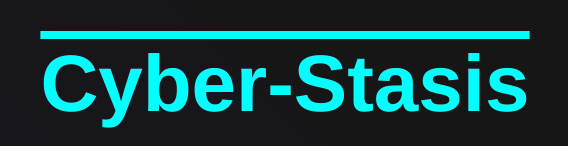
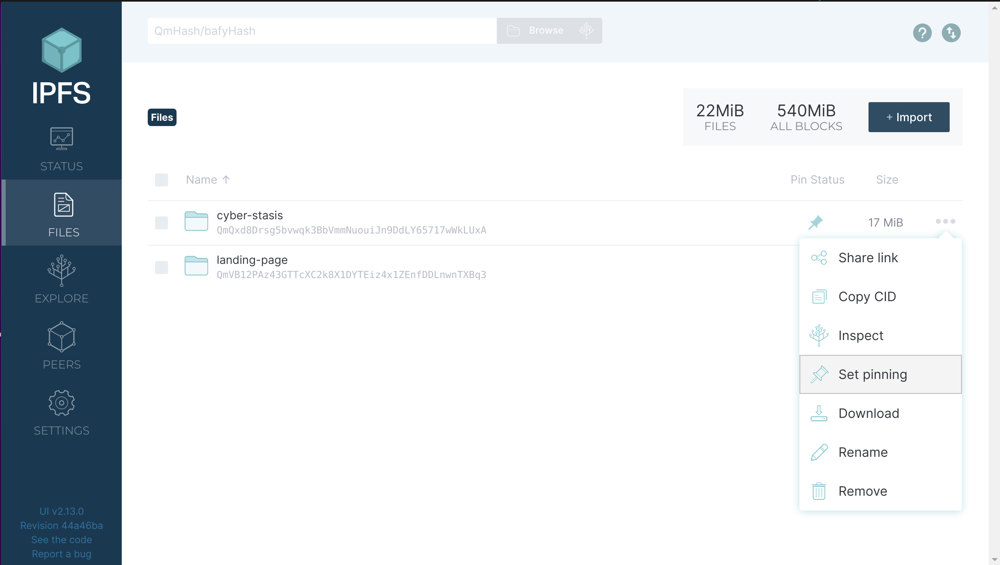
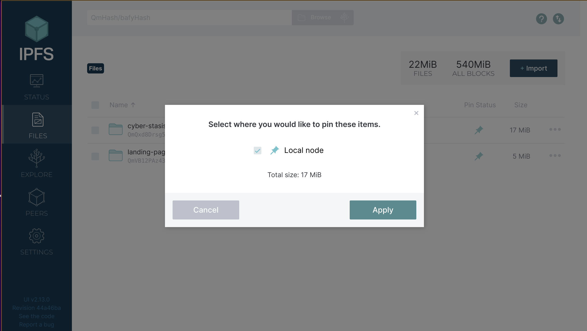
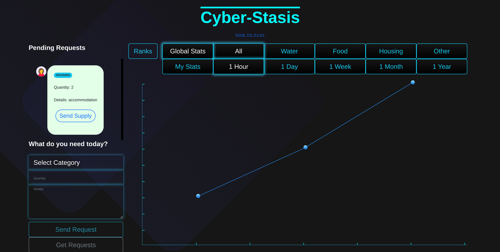
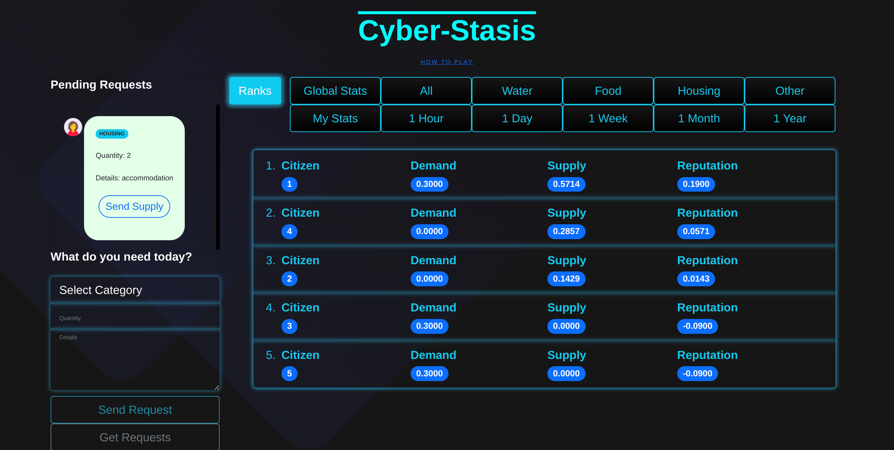
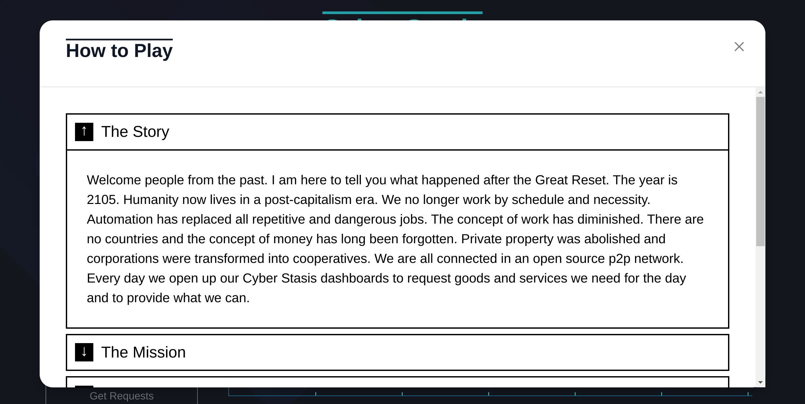
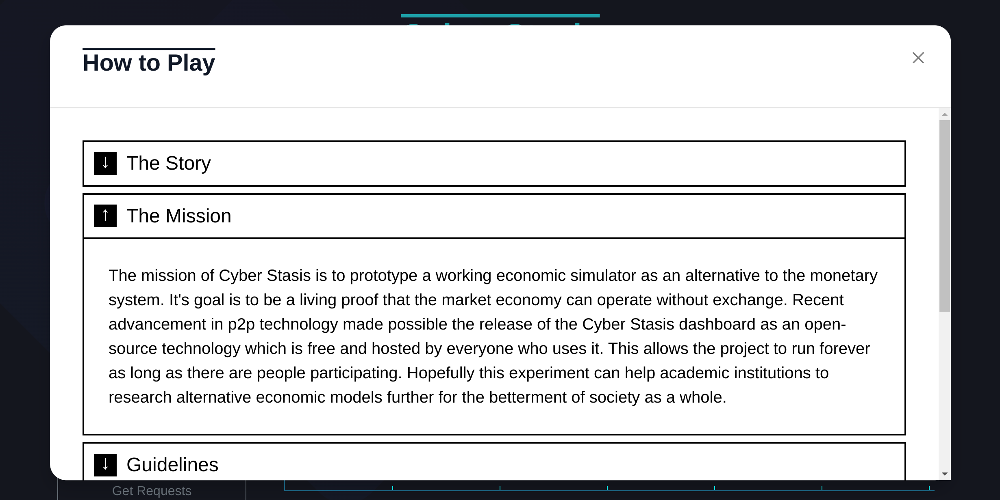

# Cyber Stasis



Cyber Stasis is an economic simulator in the form of a free fictional game. The interface is a futuristic dashboard which coordinates global real-time demand and supply. The model is based on gift economy and tests the hypothesis of having a market system without any type of exchange be it barters or money.
The market system provides a feedback loop between production and consumption and is oriented towards efficiency of distribution. Everything that we measure with money can be measured by a ratio between supply and demand. There is no private property and a concept of wealth. The goal of the system is to make sure that all needs are met to the best extent possible. There is a personal reputation index which measures your contributions to society but it does not give any privileges. The goal of the game is to become the most useful member of society.

## How to Play

The game runs on the public IPFS network. In order to play it follow the steps below:

1. Install the official IPFS Desktop http://docs.ipfs.io/install/ipfs-desktop/
2. Install IPFS Companion http://docs.ipfs.io/install/ipfs-companion/
3. Install golang 1.17 or later version - https://go.dev/doc/install
4.  Clone https://github.com/stateless-minds/go-ipfs to your local machine
```
git clone https://github.com/stateless-minds/go-ipfs.git
```
5.  Follow the instructions here to open your config file: https://github.com/ipfs/go-ipfs/blob/master/docs/config.md. Usually it's `~/.ipfs/config` on Linux. Add the following snippet to the `HTTPHeaders`:
```{
  "API": {
    "HTTPHeaders": {
      "Access-Control-Allow-Origin": ["webui://-", "http://localhost:3000", "http://bafybeid6xrjkqbpdscmyu4esqyeyul5qit6tplvvaif7db6hreqmftsxvq.ipfs.localhost:8080", "http://127.0.0.1:5001", "https://webui.ipfs.io"],
      "Access-Control-Allow-Credentials": ["true"],
      "Access-Control-Allow-Methods": ["PUT", "POST"]
    }
  },
 ```
6. Build it and start the daemon:
``` 
cd go-ipfs
make build
./cmd/ipfs/ipfs daemon --enable-pubsub-experiment
```
7.  Navigate to <a href="https://ipfs.io/ipfs/QmWsNdgDCayEaGB69Xpm8UhkaxUrx7ZfEXkMmKPeiteD63">https://ipfs.io/ipfs/QmWsNdgDCayEaGB69Xpm8UhkaxUrx7ZfEXkMmKPeiteD63</a> and let's simulate the future together!
8.  If you like the game consider pinning it to your local node so that you become a permanent host of it while you have IPFS daemon running



Please note the game has been developed on a WQHD resolution(2560x1440) and is currently not responsive or optimized for mobile devices. For best gaming experience if you play in FHD(1920x1080) please set your browser zoom settings to 150%.

## Guidelines

* **Economic simulator** - Cyber Stasis is an economic simulator in the form of a fictional game based on global real-time demand and supply.
* **Real-time demand/supply graph** - The graph reflects all demand and supply requests and is updated in real-time.
* **Supply can be sent only in response to an existing demand** - Send only goods and services you can provide in real life.
* **Keep it real** - Send requests for your real daily needs to make the whole simulation as accurate as possible.
* **Global events** - When the supply/demand ratio drops below certain thresholds global events are triggered and sent as notifications such as global shortage of water, food and housing.
* **Do what you do in real life** - Ask for things you need and supply things you provide.
* **Rankings** - Rankings reflect the level of contribution and usefulness of members to society. They take all factors into account and are calculated by a formula. The Reputation Index is the score in the game. Provide more than you consume and become the most valuable member of society!
* **No collection of user data** - Cyber Stasis does not collect any personal user data.
* **User generated content is fictional** - All user generated content is fictional and creators are not responsibile for it.
* **If you like it support it** - This is an open source community project. Feel free to improve it or fork it and use it for your projects. Donations are welcome.

## Screenshots

<a display="inline" href="./assets/home.png?raw=true">

</a>

<a display="inline" href="./assets/ranks.png?raw=true">

</a>

<a display="inline" href="./assets/story.png?raw=true">

</a>

<a display="inline" href="./assets/mission.png?raw=true">

</a>

## Roadmap
1. Make it responsive - Not started
2. Make it mobile friendly - Not started. It will require a very different approach with a different client: https://berty.tech/docs/gomobile-ipfs/

## Ideas
1. Create a liquid democracy voting system that integrates seamlessly with the economy simulator.: https://www.reddit.com/r/CyberStasis/comments/uvixbz/possible_future_scenarios_and_implications_of_a/
2. Create media platform where people can publish their own news instead of relying on mass media and seamlessly integrate it with the economy simulator: https://www.reddit.com/r/CyberStasis/comments/uvixbz/possible_future_scenarios_and_implications_of_a/
3. Add resources available data fetched from external public APIs and keep track of it during production/consumption cycles

## Inspirations
1. Auroville
https://auroville.org
2. CyberSyn
https://en.wikipedia.org/wiki/Project_Cybersyn
3. The Venus Project
https://www.thevenusproject.com
4. OGAS
https://en.wikipedia.org/wiki/OGAS

## Acknowledgments

1. <a href="https://go-app.dev/">go-app</a>
2. <a href="https://ipfs.io/">IPFS</a>
3. <a href="https://berty.tech/">Berty</a>
4. All the rest of the authors who worked on the dependencies used! Thanks a lot!

## Contributing

<a href="https://github.com/stateless-minds/cyber-stasis/issues">Open an issue</a>

## License

Stateless Minds (c) 2022 and contributors

MIT License
